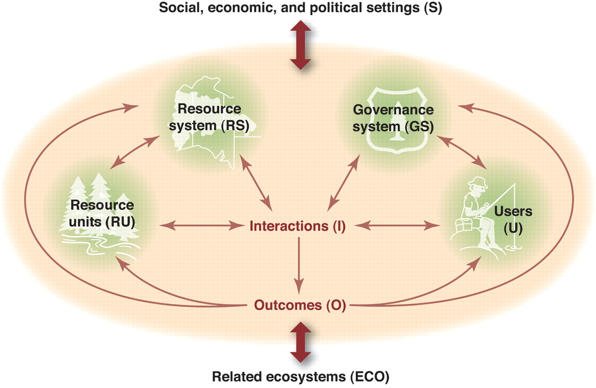

  
```{r setup, include=FALSE}
knitr::opts_chunk$set(warning = FALSE, message = FALSE, 
                      fig.retina = 3, fig.align = "center")
```

```{r xaringanExtra, echo=FALSE}
xaringanExtra::use_webcam()
```

.pull-left[
# Course Introduction and Overview
<figure>
  
</figure>
]

.pull-right[

</br>
</br>
</br>
**POLI 443 - EVSS 595: Governance of Social-Ecological Systems**

**Fall 2021**

.light[Matthew Nowlin, PhD<br>
Department of Political Science<br>
College of Charleston
]

]

---

class: title title-1

# COVID-19 

.pull-left[
**It's not over** 

**Get vaccinated!**

**Masks must be worn in class at all times** 

**If you don't feel well, don't come to class**

**If you have been exposed to COVID-19, don't come to class** 
]

.pull-right[
</br>
<figure>
  
</figure>
]

---

class: center, middle

# Syllabus Stuff

---

class: title title-1

# The Syllabus 

**It's on OAKS (lms.cofc.edu)** 

**Content -> Course Information -> Syllabus** 

**Provides an overview of the course and includes required materials and assignments** 

**Readings and due dates may change**

**Be patient and be flexible** 

---

class: title title-1

# Your Professor 

.pull-left[
<figure>
  
</figure>
]

.pull-right[
- Dr. Matthew C. Nowlin 

- Email: [nowlinmc@cofc.edu](mailto:nowlinmc@cofc.edu)

- ~~Office~~ Student hours (Zoom only): Use the [Calendly link](https://calendly.com/nowlinmc/meetings) on the syllabus and on OAKS  

- **Public Policy Concentration** 

- **Environmental Policy Research Group** 
]


---

class: title title-1

# What is this course about? 

Social-ecological systems are ecological systems that are linked to and affected by one or more social systems. Management and governance of such systems include a wide range of stakeholders and institutions. In this course we will examine various approaches to governing and managing these systems to make them more resilient.  

---

class: title title-1

# What is this course about? 

.pull-left[
**The work of Elinor Ostrom** 
* Commons management

* The Institutional Analysis and Development Framework

* The Social-Ecological Systems Framework
]

.pull-right[
</br>
<figure>
<center>
  
</figure>
]

---

class: title title-1

# What is this course about? 

**The Social-Ecological Systems Framework**

.pull-left[
**Governance Systems** 
* Government organizations 
* Non-government organizations 
* Networks 
* Property-rights regimes
* Rules
]

.pull-right[
</br>
<figure>
  
</figure>
]

---

class: title title-1

# Course Goals and Learning Objectives

**The goals for this course are to**:

* Develop an understanding of social-ecological systems. 

* Articulate the challenges involved with the management of common-pool resources and social-ecological systems governance.  

* Understand the role of institutions in managing the commons and in social-ecological systems governance. 

---

class: title title-1

# Course Goals and Learning Objectives

**The goals for this course are to**:

* Differentiate the role that institutions and policy play in models of social-ecological systems. 
   
* Be able to produce a recommendation to improve governance of a social-ecological system. 

---

class: title title-1

# Learning 

* This course will be _discussion_ based. 

* Do assigned readings prior to Monday's class

* Be prepared to participate in class

* I may call on you to answer a question or discuss your case study 

* Laptops are allowed, but (only somewhat) discouraged 

* Phones should remain put away

---

class: title title-1

# Required Materials

.pull-left[
**Readings** 

* Anderies, John M., and Marco A. Janssen. 2016. _Sustaining the Commons_. 
  * pdf and link on OAKS 

* Other readings will be on OAKS 
]

.pull-right[
</br>
<figure>
  
</figure>
]

---

class: title title-1

# Required Materials

**Grad Students: More readings** 
* Ostrom, Elinor. 2005. _Understanding Institutional Diversity_.
  * pdf on OAKS 
* Biggs, Reinette et al., eds. 2021. _The Routledge Handbook of Research Methods for Social-Ecological Systems_. London: Routledge. 
  * pdf on OAKS (for reference)
* Other (more) readings will be on OAKS
* [Cases Studies of Social-Ecological Systems (Arizona State University)](https://seslibrary.asu.edu/case)

---

class: title title-1

# Course Requirements and Grading

**Assignments and Possible Points**  

* Reflection papers (8): 200 points total
* Course engagement:  100 points
* Presentation of Case Study or Research Design


* **Undergrads**: Case Study: 500 points total
* **Grads**: Case presentations (2): 100 points total 
* **Grads**: Research design: 400 points total

---

class: title title-1

# Late Work Policy 

* 48-hour grace period: _can still turn in work with no late penalty_  
* After grace period, 10% deduction for each 24 hr period its late 

* After 72 hours beyond grace period, assignment will not be accepted 

---

class: title title-1

# Important Information 

**Make note of:** 

* **Honor Code and Academic Integrity** 
* **Students with Disabilities** 
* **Financial Challenges** 
* **Counseling Center** 
* **Center for Student Learning**
* **Religious Holiday Policy** 
* **Weather**

---

class: center, middle

# Introduce yourselves! 

---

class: center, middle

# Quick Course Overview 

---

class: title title-1

# Course Overview 

**Topics we will discuss this semester:** 

.pull-left[
* Common-Pool Resources 
* Markets and Property Rights
* States and Regulation
* Institutions
* Action Arenas
]

.pull-right[
* Design Principles
* Rules
* Systems 
* Resilience
* Polycentricity
]

---

class: title title-1

# For Next Time 

**Common-Pool Resources** 

**Readings (Everyone)**: 

* **SKIM**: Cox, Michael. 2019. “_Using the Ostrom Workshop Frameworks to Study the Commons_.”
* **AJ**, Chapter 1: _Why Study the Commons_? 
* [The Tragedy of the _Tragedy of the Commons_](https://blogs.scientificamerican.com/voices/the-tragedy-of-the-tragedy-of-the-commons/) 
* **SKIM**: Ostrom, Elinor. 2008. “The Challenge of Common-Pool Resources.” _Environment: Science and Policy for Sustainable Development_ 50(4): 8—21. 

---

class: title title-1

# For Next Time 

**Common-Pool Resources** 

**Readings (Grads)**:

* Frischmann, Brett M., Alain Marciano, and Giovanni Battista Ramello. 2019. “Retrospectives: Tragedy of the Commons after 50 Years.” _Journal of Economic Perspectives_ 33(4): 211–28.

---

class: title title-1

# For Next Time 

**Common-Pool Resources** 

**Assignments (Everyone)**: 

* Reaction paper 1, **Monday at 3:25** 


