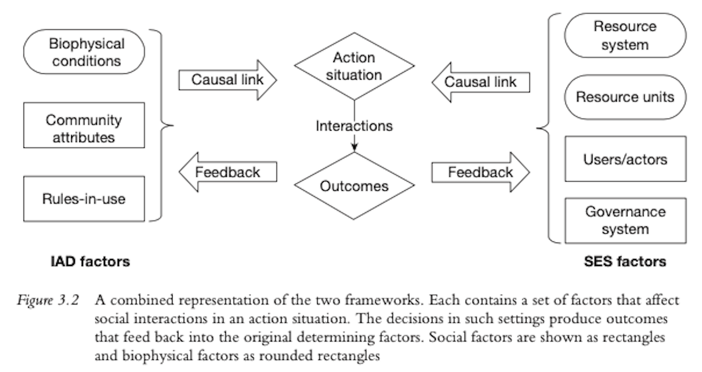

  
```{r setup, include=FALSE}
knitr::opts_chunk$set(warning = FALSE, message = FALSE, 
                      fig.retina = 3, fig.align = "center")
```

```{r xaringanExtra, echo=FALSE}
xaringanExtra::use_webcam()
```

.pull-left[
# Common-Pool <br> Resources
<figure>
  
</figure>
]

.pull-right[

</br>
</br>
</br>
**POLI 443 - EVSS 595: Governance of Social-Ecological Systems**

**Fall 2021**

.light[Matthew Nowlin, PhD<br>
Department of Political Science<br>
College of Charleston
]

]

---

class: center, middle 

# What is the _tragedy of the commons_? 

---

<figure>
<center>
  
</figure>

---

.pull-left[
<figure>
  
  
</figure>
]

.pull-right[
</br>
<figure>
  
</figure>
]


---


class: title title-1

# Externality


.pull-left[
**Externalities**: occur when the total costs and benefits are not captured by the price 
* _Negative externalities_: costs spread from buyers and sellers to society as a whole
]

.pull-right[
<figure>
  
</figure>
]

---

<figure>
<center>
  
</figure>

---

class: title title-1

# Hypothetical Group Work Question 

* You are assigned to do a group project for a class. Everyone in the group will receive the same grade _regardless of their individual effort_ 

* Does everyone in the group do the same level of work? 

---

class: title title-1

# Other Examples 

**Do you use _Rate My Professor_?** 

--

**The _Prisoner's Dilemma_** 

--

</br>
## These all are examples of _collective dilemmas_

---

class: title title-1

# Collective Dilemmas 

**Situations that arise when the goals of the individual conflict with those of the group**

--

* What is best for the individual cattle owner? 

* What is best for the individual firm? 

* What is best for the individual roommate?

* What is best for the individual student? 

---

class: title title-1

# Types of Goods 

<figure>
  
</figure>

---

class: title title-1

# Commons 

**Shared land not owned by individuals but "shared in common."** 
* Rules of use set and enforced by the users 

--

**A broad set of resources, natural and cultural, that are shared by many people** 

* Open-access: no shared property rights 

???
first definition from medieval europe 

---

class: title title-1 

# The Tradegy of the Commons 

.pull-left[
<figure>
<center>
  
</figure>
]

.pull-right[
<figure>
</br>
  
</figure>
]

---

class: title title-1 

# The Tradegy of the Commons 

<figure>
  
</figure>

--

**It follows that two options are available:** 

1) establish, monitor, and enforce private property rights 

2) directly regulate the use of the commons either by taxing or directly restricting (e.g., licensing) its use

???
is hardin wrong? are common pool resources being depleted? 

---

class: center, middle 

# Which are some critiques of Hardin’s _ideas_?

???
history wrong - commons were often well-regulated by users; implications of views about over population; right about human nature?; is freedom to breed intorable?   

---

class: title title-1

# Critiques 

* History wrong 

* Assumptions (human behavior)

* Fear 


---

class: title title-1 

# The Tradegy of the Commons 

<iframe width="560" height="315" src="https://www.youtube.com/embed/g8yOamWq3a0" title="YouTube video player" frameborder="0" allow="accelerometer; autoplay; clipboard-write; encrypted-media; gyroscope; picture-in-picture" allowfullscreen></iframe>

---

class: center, middle 

# The Ostrom approach 

---

class: title title-1

# Panacea 

.pull-left[

</br> 

**Greek goddess of the universal remedy** 

]


.pull-right[
<center>
<figure>
  
</figure>
]


---

class: title title-1

# Ostrom 

.pull-left[
_The most important lesson that needs wide dissemination is that simple panaceas offered for solving problems related to the commons—whether they are for government, private, or community ownership—may work in some settings but fail in others_ 
]

.pull-right[
</br>

<figure>
  
</figure>
]


---

class: title title-1 

# Achieving Adaptive Governance

* Achieving accurate and relevant information 

--

* Dealing with conflict

--

* Enhancing rule compliance

--

* Providing infrastructure

--

* Encourage adaptation and change

--

**Design principles** 

---

class: title title-1 

# Ostrom's Critiques of Hardin 

**Two questions**: 

* How well does the tragedy of the commons allegory describe reality?

--

* Does the binary choice between government command-and-control regulation and private property–enabled markets reflect the full range of options?


???
how realistic are lab settings? one-shot games? 

Ostrom: Simply enabling subjects to engage in face-to-face communication between decision rounds enables them to approach socially optimal harvest- ing levels rather than severely overharvesting the commons

---

class: title title-1

# The Ostrom Frameworks 

<figure>
<center>
  
</figure>

---

class: title title-1

# The IAD Framework 

.pull-left[
**Components**
- Biophysical characteristics
- Attributes of the community
- Rules-in-use
- **Action situation** 
- **Actors** 
- Patterns of interactions
- Outcomes 
- Evaluative criteria 
]


.pull-right[
**Framework**
</br>
</br>
<figure>
<center>
  
</figure>
]


---

class: title title-1

# Social-Ecological Systems  

**An ecological system intricately linked with and affected by one or more social systems** 

<figure>
<center>
  
</figure>

---

class: title title-1

# Combing the Frameworks 

<figure>
<center>
  
</figure>

---

class: title title-1

# For Next Time 

**Markets and Property Rights** 

* _Readings_ (Everybody): 
	* Keohane and Olmstead. 2016. "The Efficiency of Markets" in _Markets and the Environment_
	* Anderson, Terry L. and Gary D. Libecap. 2014. “Property Rights for the Common Pool” from _Environmental Markets: A Property Rights Approach_
	* Fullerton, Don, and Robert Stavins. 1998. “How Economists See the Environment.” _Nature_ 395(6701): 433—434. 

---

class: title title-1

# For Next Time 

**Markets and Property Rights** 

* _Readings_ (Grad students):
  * Anderson, Terry L. 2004. “Donning Coase-Coloured Glasses: A Property Rights View of Natural Resource Economics.” _Australian Journal of Agricultural and Resource Economics_ 48(3): 445—462. 

* _Assignments_ (Everybody):
	* Reflection paper 2


