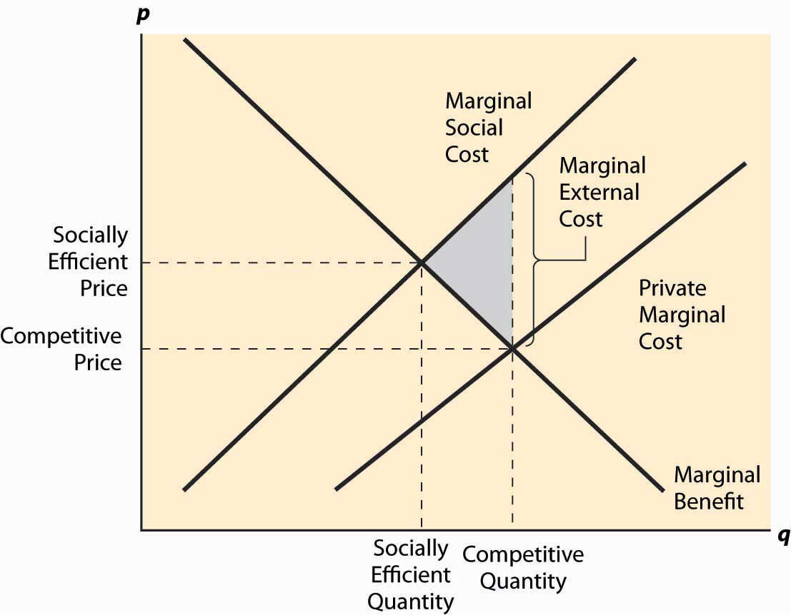

  
```{r setup, include=FALSE}
knitr::opts_chunk$set(warning = FALSE, message = FALSE, 
                      fig.retina = 3, fig.align = "center")
```

```{r xaringanExtra, echo=FALSE}
xaringanExtra::use_webcam()
```

.pull-left[
# Markets and Property Rights
<figure>
  
</figure>
]

.pull-right[

</br>
</br>
</br>
**POLI 443 - EVSS 595: Governance of Social-Ecological Systems**

**Fall 2021**

.light[Matthew Nowlin, PhD<br>
Department of Political Science<br>
College of Charleston
]

]

---

class: title title-1

# Markets 

<br>
<br>

**A market is a decentralized collection of buyers and sellers whose interactions determine the allocation of a good or set of goods through exchange.** 

-_Keohane and Olmstead_ pg. 71 

---

class: title title-1

# Demand and Supply 

<br>

**Demand curve**: how much buyers in the aggregate will buy at a given market price, with all other factors (such as the prices of other goods) held constant
* Downward sloping 
* _Marginal willingness to pay_ 

---

class: title title-1

# Demand and Supply 

<br>

**Supply curve**: represents how much the sellers (collectively) are willing to sell or produce at a given price
* Upward sloping 
* _At higher prices output expands_ 

---

class: title title-1

# Market Equilibrium

**The market equilibrium is the combination of quantity and price for which supply equals demand** 

* Stable equilibrium 

* Happens _automagically_ as long as underlying factors remain constant 

* Adam Smith's _invisible hand_ 

---

class: title title-1

# Market Equilibrium

<center>
<figure>
  
</figure>

---

class: center, middle 

# What is being assumed about human nature? 

---

class: title title-1 

# Utility 

.pull-left[
**Jeremy Bentham** 

<figure>
  
</figure>
]

.pull-right[
**John Stuart Mill**

<figure>
  
</figure>
]


???
_Seek pleasure and avoid pain_ 

* What is moral are actions that provide pleasure and avoid pain 
* Greatest-happiness principal 
* Greatest good for the greatest number 

the ones who walk away from omelas (aa-muh-liz)

---

class: title title-1 

# Utility 

.pull-left[
**Individuals see to maximize expected utility** 

Expected utility: 

<figure>
  
</figure>
]


.pull-right[
<center>
<figure>
  
</figure>
]

---

class: title title-1 

# Surplus 

.pull-left[
**Consumer surplus**: difference between WTP and what is actually paid 

**Producer surplus**: difference between revenues and cost of production
]


.pull-right[
<figure>
  
</figure>
]

???
producer surplus is variable cost; profit includes fixed and variable costs 

---

class: title title-1

# Efficiency

**Maximizing net benefits** 
* Difference is greatest between total cost and total benefit 
* Marginal cost = marginal benefit

--

**Pareto efficiency** 
* No one could be made better off without someone else being made worse off 

---

class: title title-1

# Efficiency

**Three conditions**: 

--

1. **Competitive**: price takers 

--

2. **Information**: complete  

--

3. **Complete**: benefits and costs captured by price  

--

**Market failures occur when these conditions are not met** 

---

class: center, middle 

# What are some prevalent myths about how economists think about the environment?

???
myth of universal markets

myth of market solutions 

myth of market prices 

myth of efficiency 

---

class: title title-1

# Externality

.pull-left[
**Externalities**: occur when the total costs and benefits are not captured by the price 
* _Negative externalities_: costs spread from buyers and sellers to society as a whole
]

.pull-right[
<figure>
  
</figure>
]

???
externalities = social cost 

---

class: title title-1

# Coase Theorem 

.pull-left[
</br>
_Private bargaining will result in the efficient resolution of negative externalities, without the need for government intervention, as long as property rights are fully allocated_  
]

.pull-right[
<figure>
<center>
  
</figure>
]

---

class: title title-1

# Coase Theorem 

.pull-left[
**Works when _transaction costs_ are low** 

**Transaction costs**: 
* The costs associated with a transaction 

_The transactions costs associated with government regulation tend to be high_ 

]

.pull-right[
<figure>
<center>
  
</figure>
]

---

class: title title-1

# Property Rights 

**The rights to own or control property and includes the right to use, to transfer ownership, and exclude from others.** 

--

_Problems arise when property rights are incomplete and/or ill-defined_ 

--

_Who is imposing costs on whom?_ 

--

**Missing markets not market failures** 

---

class: title title-1

# Coase and the Commons 

* Competition for the common pool 
  * Scarcity (and rivalrous goods) attracts competition
  * Ranchers vs homesteaders 

--

* Reciprocal costs
  * Costs to one is a benefit to another 
  * The Dr and the candy maker
  * Neighbor's loud music 

---

class: title title-1

# Coase and the Commons 

**Property rights internalize costs and benefits**  

<br>

.pull-left[
.small[_Wheat and Cattle_]
<figure>
  
</figure>
]

--

.pull-right[
* Tragedy avoided through bargaining 
* Farmer pays rancher $65 to not add fourth cow
]


???
Table illustrates the tragedy of the commons

---

class: title title-1

# Coase and the Commons 

**Requires two conditions**: 

* The property rights are well-defined and enforced 

* The costs of bargaining are low enough to allow the parties to reach agreement 

--

_Clearly-defined property rights encourage bargaining to resolve the problem of reciprocal costs_  

---

class: center, middle 

# What is a Coase approach to climate change? 

???
cap and trade 


