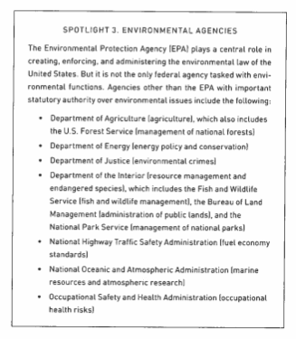

  
```{r setup, include=FALSE}
knitr::opts_chunk$set(warning = FALSE, message = FALSE, 
                      fig.retina = 3, fig.align = "center")
```

```{r xaringanExtra, echo=FALSE}
xaringanExtra::use_webcam()
```

.pull-left[
# States and <br> Regulation
<figure>
  
</figure>
]

.pull-right[

</br>
</br>
</br>
**POLI 443 - EVSS 595: Governance of Social-Ecological Systems**

**Fall 2021**

.light[Matthew Nowlin, PhD<br>
Department of Political Science<br>
College of Charleston
]

]

---

class: title title-1

# Regulating Impacts 

**Environmental regulation attempts to regulate human behavior to lessen negative environmental impacts** 

--

**Characteristics of Environmental Impacts** 

* Diffusion 
* Complexity 
  * Obscure, technical, and interactive
* Nonhuman 

---

class: title title-1

# Functional Separation 

<figure>
<center>
  
</figure>

---


class: title title-1

# Separation of Power 

| Congress | President | Courts 
--- | --- | --- | --- 
**Legislative** | **make laws** | recommend laws, veto, regulations | review laws  
**Executive** | override vetos, oversight | **enforce and implement laws** | review executive acts 
**Judicial** | advise and consent | pardon, nominate judges | **interpret laws** 


---

class: title title-1

# Executive Branch Agencies 

.pull-left[
<figure>
  
</figure>
] 

--

.pull-right[
<figure>
<center>
  
</figure>
]

---

class: title title-1

# Types of Law 

**Constitutional law**: 
* provides for the structure and function of government

* includes limits on government and individual rights 

---

class: title title-1

# Types of Law 

**Common law**:
* no comprehensive, codified set of rules 

* open to judicial interpretation 

* precedent; _stare decisis_ 

* private: contract, property, and tort 

* public: **administrative law** 

---

class: title title-1

# Types of Law 

**Statutes** 

* How does a bill become a law? 

--

.pull-left[
<center>
<figure>
  
</figure>
]

--

.pull-right[
<figure>
  
</figure>
]

---

class: title title-1

# Types of Law 

**Regulations** 

--

<figure>
<center>
  
</figure>

???
* Executive orders 

---

class: title title-1

# Regulatory Instruments 

* Command-and-control regulation 

--

* Economic instruments (Market-based)

--

* Information-based instruments 

--

* _Behavioral instruments_ (Nudges)

--

**Sticks, carrots, and sermons** 

???
grad students: what did the article say?

---

class: title title-1

# Ecosystem Management 

**Ecological systems (ecosystems)**: geographic areas where living entities (plants, animals, and other organisms) and nonliving entities (including water, air, and soil) interact in mutually interdependent ways

--

**Ecosystem management**: seeks to preserve, sustain, and secure whole ecosystems and the qualities of ecosystems that are deemed valuable 

* Trade-off competing social, cultural, and environmental values
* _Ecosystem services_: benefits ecosystems provide to humans 

---

class: center, middle

# What are some challenges associated with ecosystem management? 

???
possibility of "tipping points" 
geographic and temporal space 
multiple levels of government
clashing view points of stakeholders
---

class: title title-1

# Ecosystem Management 

<figure>
<center>
  
</figure>

---

class: title title-1

# Ecosystem Management 

**Biodiversity** 

--

Is it important? why? 

--

.pull-left[
**Challenges** 
* Informational burdens 
* Value trade-offs

]
--

.pull-right[
**Managing biodiversity** 
* Protection of specific wildlife (ESA) and ecosystems 
* NEPA and environmental impact assessments 
]


---

class: title title-1

# Ecosystem Management 

**Wildlife** 

--

.pull-left[
**Challenges** 
* Informational burdens
* Which types of life to protect and why?
]

--

.pull-right[
_Endangered Species Act_ 
* Endangered 
* Threatened 
* Critical habit 
]

---

class: title title-1

# Ecosystem Management 

**Wetlands** 

--

.pull-left[
**Challenges**
* Definitional difficulties 
* Many types of wetlands 
* Range of ecosystems services, but value trade-offs 
]

--
.pull-right[
_Waters of the United States_ 

??
]

---

class: title title-1

# Ecosystem Management 

**Land Management and Public Lands** 

--
.pull-left[
**Challenges** 
* How much land should be set aside and for what use? 
* Best management practices
]

--

.pull-right[
**Agencies**: 
* Forest Service (Dept of Ag)
* Bureau of Land Management (Dept of Interior)
* Fish and Wildlife Service (Dept of Interior)
* National Park Service (Dept of Interior)
]

---

class: title title-1

# Ecosystem Management 

**Agriculture** 

--

.pull-left[
**Challenges** 
* Short-term productivity vs long-term sustainability 
* Increasing variability of production 
* Which species to cultivate 
]

???
monocropping 
--

.pull-right[
**USDA**
* Farm subsides 
* Pollution control 
* _Nonpoint source_ pollution
]


