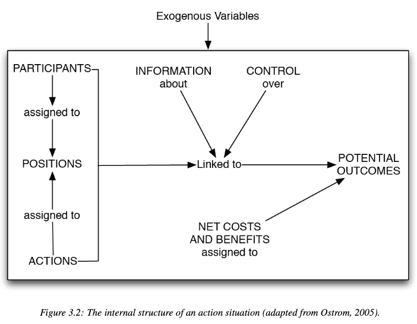

  
```{r setup, include=FALSE}
knitr::opts_chunk$set(warning = FALSE, message = FALSE, 
                      fig.retina = 3, fig.align = "center")
```

```{r xaringanExtra, echo=FALSE}
xaringanExtra::use_webcam()
```

.pull-left[
# Action Arenas <br> Action Situations 

<br>
<figure>
  
</figure>
]

.pull-right[

</br>
</br>
</br>
**POLI 443 - EVSS 595: Governance of Social-Ecological Systems**

**Fall 2021**

.light[Matthew Nowlin, PhD<br>
Department of Political Science<br>
College of Charleston
]

]

---

class: title title-1

# The IAD 

<figure>
<center>
  
</figure>

???
The IAD framework assumes that actors who repeatedly interact can develop stable and mutually beneficial behavioral regularities @arnoldInfluenceOrganizationsInstitutions2013

---

class: center, middle 

# What is an action arena? What is an action situation? 

---

class: title title-1

# Action Situation and Action Arenas

**Action situation**:  two or more individuals faced with a set of potential actions that jointly produce outcomes

* Participants that occupy a certain position 

--

**Action arena**: combines the action situation, which focuses on the rules and norms, with the participants who bring with them their individual preferences, skills, and mental models


---

class: title title-1

# The Snatch Game 

<br>

.pull-left[
<figure>
  
</figure>
]


.pull-right[
<figure>
  
</figure>
]

---

class: title title-1 

# Action Situations 

**Contain the following variables**: 

--

* The set of participants

--

* The positions to be filled by participants

--

* The potential outcomes

--

* The set of allowable actions and the function that maps actions into
realized outcomes

---

class: title title-1 

# Action Situations 

**Contain the following variables**: 

* The control that an individual has in regard to this function

--

* The information available to participants about actions, outcomes, and the linkages between them

--

* The costs and benefits — which serve as incentives and deterrents — assigned to actions and outcomes 

---

class: title title-1 

# Action Situations 

<figure>
<center>
  
</figure>

---

class: title title-1 

# Action Situations: Working Parts 

**Participants** 

_Participants in an action situation are assigned to a position and capable of making a choice between different possible actions_

--

* The number of participants 

--

* Their status as individuals or as a team or composite (unitary) actor

--

* Attributes of participants

???
individuals or unitary actor (level of aggregation) depends on question we are addressing; basketball - 10 players or 2 two teams of 5 players each

---

class: title title-1 

# Action Situations: Working Parts 

**Positions** 

_Positions refer to **roles** that participants can play in an action situation_ 

--

* Participants > roles 

--

* Positions connect participants with potential actions that they may take in an action situation
  * Provides opportunities and constraints

---

class: title title-1 

# Action Situations: Working Parts 

**Potential outcomes**

_When we want to understand how rules, attributes of the environment, or attributes of the community change an action situation, **careful attention must be given to how participants value certain outcomes**_

--

* Monetary, quantity, morality 

--

* _Unintended outcomes_: not all outcomes are the result of self-conscious decisions

---

class: title title-1 

# Action Situations: Working Parts 

**Actions** 

_A selection of a setting or a value on a control variable (e.g., a dial or switch) that a participant hopes will affect the outcomes_ 

--

* _Choice_: The specific action selected

--

* _Strategies_: A complete specification of the actions, taking in
all possible variations of the action situation 

---

class: title title-1 

# Action Situations: Working Parts 

**Control** 

_The ability that a participant holds to affect the actions of other participants and outcomes_ 

--

* Connection to the participants position 

--

* **Power** 
  * Positive 
  * Negative 

???
two faces of power 

---

class: title title-1 

# Action Situations: Working Parts 

**Information about the action situation**

--

_Complete information_: know the number of participants, the positions, the outcomes, the actions available, how the actions are linked to outcomes, the information available to other players, and the payoffs available. 

--

_Perfect information_: know what the other participants will do

--

_Asymmetric information_: lack of perfect information 
* Principal-agent problem 

---

class: title title-1 

# Action Situations: Working Parts 

**Costs and benefits** 

_Used to evaluate outcomes_ 

_But, there is a distinction between the physical outcome and the **valuation that a participant assigns to that outcome**, or the utility a participant associates with the outcome_. 

--

Are the benefits $>$ costs? 

---

class: title title-1 

# Action Situations: Working Parts 

**Linking action situations** 

--

_Organizational connections_ 

--

_Structured over time_

--

**Three levels of rules** 
* Operational
* Collective 
* Constitutional 

---

class: title title-1 

# Action Situations: Working Parts 

**Linking action situations** 

.pull-left[
<figure>
<center>
  
</figure>
]

--

.pull-right[
**Constitutional-choice rules**: _affect collective-choice activities by determining who is eligible to be a participant and the rules to be used in crafting the set of collective-choice rules that, in turn, affect the set of operational rules._
]

---

class: title title-1 

# Action Situations: Working Parts 

**Linking action situations** 

.pull-left[
<figure>
<center>
  
</figure>
]

.pull-right[
**Collective-choice rules**: _affect operational activities and results through their effects in determining who is eligible to be a participant and the specific rules to be used in changing operational rules._
]

---

class: title title-1 

# Action Situations: Working Parts 

**Linking action situations** 

.pull-left[
<figure>
<center>
  
</figure>
]

.pull-right[
**Operational rules**: _directly affect day-to-day decisions made by the participants in any setting._
]

---

class: title title-1 

# Action Situations: Working Parts 

**Linking action situations: Networks of adjacent action situations**

<figure>
<center>
  
</figure>

---

class: title title-1 

# Action Situations: Working Parts 

**Outcomes** 

* Economic efficiency: what are the costs relative to the benefits?

--

* Equity: how are costs and benefits distributed among the participants?

--

* Accountability: are participants in leadership positions accountable for the consequences of their decisions?

---

class: title title-1 

# Action Situations: Working Parts 

**Outcomes**

* Conformance to general morality: are the procedures fair, is cheating detected, and are promises kept?

--

* Sustainability: how do the outcomes evolve over time? And what are the consequences of decisions on the underlying system?


