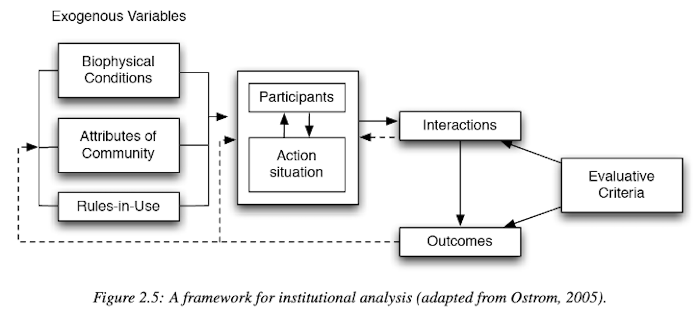
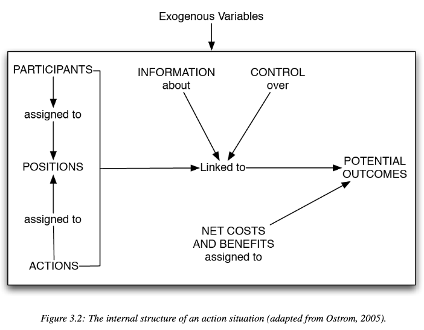
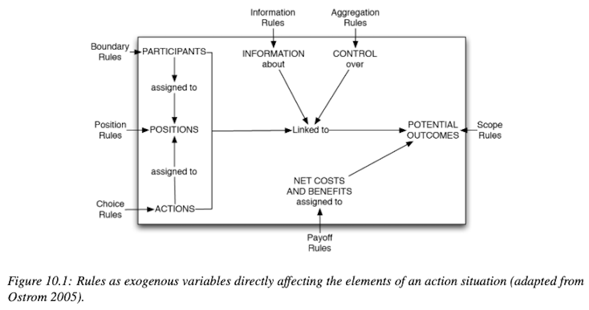
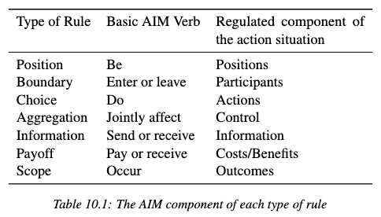
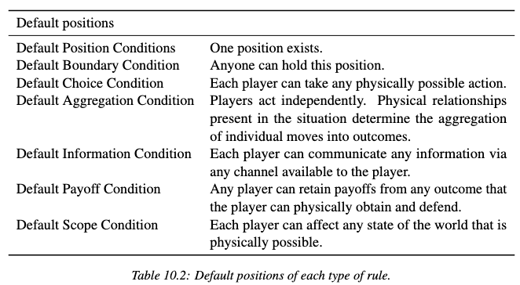
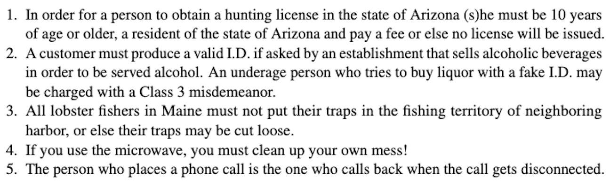

  
```{r setup, include=FALSE}
knitr::opts_chunk$set(warning = FALSE, message = FALSE, 
                      fig.retina = 3, fig.align = "center")
```

```{r xaringanExtra, echo=FALSE}
xaringanExtra::use_webcam()
```

.pull-left[
# Institutional <br> Statements 

<br>
<figure>
  
</figure>
]

.pull-right[

</br>
</br>
</br>
**POLI 443 - EVSS 595: Governance of Social-Ecological Systems**

**Fall 2021**

.light[Matthew Nowlin, PhD<br>
Department of Political Science<br>
College of Charleston
]

]

---

class: center, middle 

# What are institutional statements? 

---

class: title title-1

# Institutional Statements 
.footnote[.tiny[Ostrom 2005, 137-138]]

A broad term that encompasses the types of statements: 
* Rules 
* Norms
* Shared strategies 

--

_These statements describe opportunities and constraints that create expectations about other actors' behavior_

---

class: title title-1

# Institutional Statements 
.footnote[.tiny[Ostrom 2005, 137-138]]

_Encompasses a broad set of **shared** linguistic constraints and opportunities that prescribe, permit, or advise actions or outcomes for participants in an action situation_ 

--

Rules-in-use and attributes of the community (norms and shared strategies)

--

**Rules can be classified (or grouped together) into particular types**  

---

class: center, middle 

# Why should rules be classified?

---

class: title title-1 

# Why?
.footnote[.tiny[Ostrom 2005, pg 175]]

* to work further toward solving _babbling equilibrium_ problems for scholars doing institutional analysis 

--

* to understand how action situations are constructed so that reasonable reforms can be considered 

--

* to move beyond slogan words to describe institutions 

???
_babbling equilibrium_: senders and receivers do not understand the signal in the same way
---

class: title title-1 

# Why?
.footnote[.tiny[Ostrom 2005, pg 175]]

* to cope with the immense diversity of rules by clustering them generic rules 

--

* to look at rules as information-transformation mechanisms 

--

* to study the underlying universality of rules 

---

class: center, middle 

# How can rules be classified? 

---

class: title title-1

# The IAD 

<figure>
<center>
  
</figure>

???
The IAD framework assumes that actors who repeatedly interact can develop stable and mutually beneficial behavioral regularities @arnoldInfluenceOrganizationsInstitutions2013

---

class: title title-1 

# Action Situations 

<figure>
<center>
  
</figure>

---

class: title title-1 

# Rules 

<figure>
<center>
  
</figure>

---

class: title title-1 

# Rules 

.pull-left[
<figure>
<center>
  
</figure>
]

--

.pull-right[
**Position rules** 

_Create the positions that actors occupy_

]

---

class: title title-1 

# Rules 

.pull-left[
<figure>
<center>
  
</figure>
]


.pull-right[
**Boundary rules** 

_Entry and exit rules_ 

* Who is eligible to enter a position 
* The process that determines entry into positions
* How an individual may leave (or must leave) a position
]

---

class: title title-1 

# Rules 

.pull-left[
<figure>
<center>
  
</figure>
]


.pull-right[
**Choice rules** 

_Specify what a participant occupying a position must, must not, or may do_

_Dependent both on the positions they hold, prior actions taken by others and/or themselves and attributes of relevant state variables_
]

---

class: title title-1 

# Rules 

.pull-left[
<figure>
<center>
  
</figure>
]


.pull-right[
**Aggregation rules** 

_Determine whether a decision, made by a single participant or multiple participants, is needed prior to an action at a node in a decision process_ 

_Necessary whenever choice rules assign multiple positions partial control_
]

---

class: title title-1 

# Rules 

.pull-left[
<figure>
<center>
  
</figure>
]


.pull-right[
**Information rules** 

_Affect the level of information available to participants_

* Who is allowed to know what, when, and how 
]

---

class: title title-1 

# Rules 

.pull-left[
<figure>
<center>
  
</figure>
]


.pull-right[
**Payoff rules** 

_Assign external rewards or sanctions (fines) to particular actions that have been taken by participants or to the assessment of particular outcomes_
]

---

class: title title-1 

# Rules 

.pull-left[
<figure>
<center>
  
</figure>
]


.pull-right[
**Scope rules** 

_Affect a known outcome variable that must, must not, or may be affected as a result of actions taken within the situation_ 

* Multiple actions impact outcomes
]

---

class: title title-1 

# Rules 

**Default conditions** 

* Condition when there are no explicit rules

* Explicit rules may be added when the default conditions produce undesirable outcomes

---

class: title title-1 

# Rules 

**Default conditions** 

<figure>
<center>
  
</figure>

---

class: title title-1 

# Institutional Statements 

**Examples**

<figure>
<center>
  
</figure>

---

class: title title-1

# Grammar of Institutions 

**Institutional grammar contains a general syntax (_ADICO_)** 

* **ATTRIBUTES (A)** 

* **DEONTIC (D)** 

* **AIM (I)** 

* **CONDITIONS (C)** 

* **OR ELSE (O)** 

---

class: title title-1

# Grammar of Institutions 

**ATTRIBUTES (A)** 

_Defines the participants to whom the statement applies_ 


--

**Example**: 

_In order for a person to obtain a hunting license in the state of Arizona (s)he must be 10 years of age or older, a resident of the state of Arizona and pay a fee or else no license will be issued_

--

**a person who wants to obtain a hunting license in the state of Arizona** 

---

class: title title-1

# Grammar of Institutions 

**ATTRIBUTES (A)** 

_Defines the participants to whom the statement applies_ 

**Example**: 

_If you use the microwave, you must clean up your own mess!_ 

--

**a person that uses the microwave; _if you use the microwave_** 

---

class: title title-1

# Grammar of Institutions 

**DEONTIC (D)**

_Draws on deontic logic to distinguish prescriptive from non-prescriptive statements_ 

* Permitted: Can, may

* Obliged: Must, should

* Forbidden: Must not, should not  

???
deontic logic:  the field of philosophical logic that is concerned with obligation, permission, and related concepts

---

class: title title-1

# Grammar of Institutions 

**DEONTIC (D)**

_Draws on deontic logic to distinguish prescriptive from non-prescriptive statements_ 

**Example**: 

_All lobster fishers in Maine **must not** put their traps in the fishing territory of neighboring harbor, or else their traps may be cut loose.__

---

class: title title-1

# Grammar of Institutions 

**AIM (I)**

_The specific description of a working part in an action situation to which an institutional statement refers_

* Action 

--

**Example**: 

_The person who places a phone call is the one who **calls back** when the call gets disconnected_

---

class: title title-1

# Grammar of Institutions 

**CONDITIONS (C)**

_Indicate the set of variables that define when and where an institutional statement applies_ 

--

**Example**: 

_The person who places a phone call is the one who calls back **when the call gets disconnected**_

---

class: title title-1

# Grammar of Institutions 

**OR ELSE (O)**

_The consequence that an institutional statement assigns to detected noncompliance with the other components of the statement_ 

--

**Example**: 

_All lobster fishers in Maine must not put their traps in the fishing territory of neighboring harbor, **or else their traps may be cut loose**_

---

class: title title-1

# Rules, Norms, Shared Strategies 

**What are the differences between rules, norms, and shared strategies?** 

--

**Rules**: contain all five elements: ADICO 

--

**Norms**: contain ADIC 

--

**Shared strategies**: contain AIC 

---

class: title title-1 

# Examples 

**You must turn in your reflection papers when they are do or else you won't pass the class** 

--

**You should raise your hand when you want to ask a question in class** 

--

**Raise your hand when you want to ask a question in class**

--

**You must do the readings** 

???
_The third and fourth [last] examples do not specify specific CONDITIONS; therefore, we assume that the rules apply for Maine fishers and microwave users under all circumstances. Note that conditions often apply to physical reality—i.e., when a call is disconnected. However, conditions are often specified by scope rules that restrict choices to very specific conditions_ 

---

class: center, middle 

# How might institutional grammar be useful? 


---

class: title title-1

# The IAD 

**How to use the IAD framework (McGinnis 2013)** 

* Step 1: Theoretical puzzle or policy analysis? 

--

* Step 2: Summarize 2-3 plausible alternative explanations 

--

* Step 3: Identify the focal (or core) action situations 

???
taken from institutions lecture 
---

class: title title-1

# The IAD 

**How to use the IAD framework (McGinnis 2013)** 

* Step 4: Systematically examine categories of the framework 
  * Actors in positions 
  * Rules-in-use 
  * Attributes of communities 
  * Types of goods 
  * Evaluative criteria 
  * Feedback loops 

---

class: title title-1

# The IAD 

**How to use the IAD framework (McGinnis 2013)** 

* Step 5: Follow the information flow 

--

* Step 6: Locate adjacent (or supplemental) action situations 

--

* Step 7: Select critical adjacent actions situations 

--

* Step 8: Compare and contrast the ways these linked and nested action situations are interrelated 

---

class: title title-1

# The IAD 

**How to use the IAD framework (McGinnis 2013)** 

* Step 9: Identify the most critical steps for more detailed analysis

--

* Step 10: Draw upon principles of research design or evaluative research to select cases for further analysis by whatever methods are best suited to that purpose


