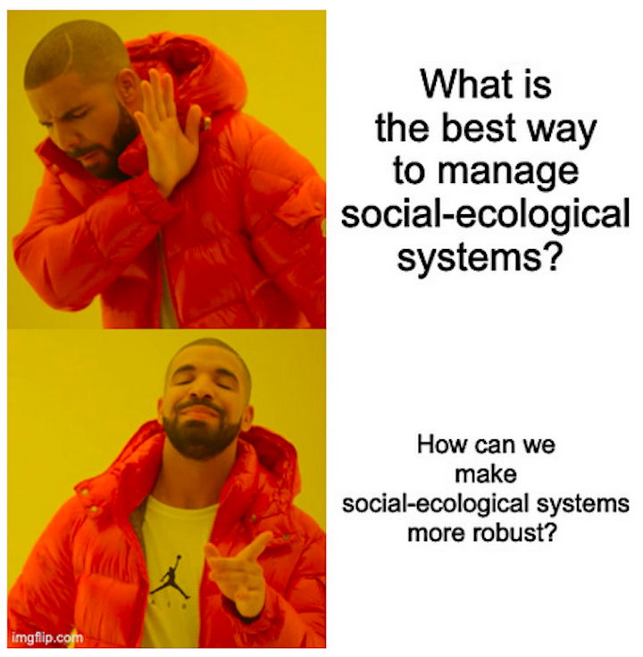

  
```{r setup, include=FALSE}
knitr::opts_chunk$set(warning = FALSE, message = FALSE, 
                      fig.retina = 3, fig.align = "center")
```

```{r xaringanExtra, echo=FALSE}
xaringanExtra::use_webcam()
```

.pull-left[
# The Social-Ecological Systems Framework

<figure>
  
</figure>
]

.pull-right[

</br>
</br>
</br>
**POLI 443 - EVSS 595: Governance of Social-Ecological Systems**

**Fall 2021**

.light[Matthew Nowlin, PhD<br>
Department of Political Science<br>
College of Charleston
]

]

---

class: center, middle 

# What is the best way to manage social-ecological systems? 

---

class: center, middle 

# ~~What is the best way to manage social-ecological systems?~~ 

---

class: center, middle 

# How can we make social-ecological systems more robust? 

---

<figure>
<center>
  
</figure>

---

class: title title-1

# Social-Ecological System 

<br>

> ## _An ecological system intricately linked with and affected by one or more social systems_* 


.left[.footnote[.small[*Anderies, John M., Marco A. Janssen, and Elinor Ostrom. 2004. “A Framework to Analyze the Robustness of Social-Ecological Systems from an Institutional Perspective.”_ Ecology and Society_ 9(1)
]]]

---

class: title title-1 

# Framework 

_A framework provides the basic vocabulary of concepts and terms that may be used to construct the kinds of causal explanations expected of a theory. Frameworks organize diagnostic, descriptive, and prescriptive inquiry._ 

--

_Frameworks identify the elements and general relationships among these elements that one needs to consider for institutional analysis and they organize diagnostic and prescriptive inquiry. They provide a general set of variables that can be used to analyze all types of institutional arrangements._

---

class: title title-1 

# Framework 1.0 

**A SES framework must address three issues:** 

--

1) cooperation and potential for collective action must be maintained within the social system, 

--

2) ecological systems are dynamic, as are the rules of the games that agents play amongst themselves, and 

--

3) ecological systems can occupy multiple stable states and move rapidly between them.

.tiny[Anderies, John M., Marco A. Janssen, and Elinor Ostrom. 2004. “A Framework to Analyze the Robustness of Social-Ecological Systems from an Institutional Perspective.” _Ecology and Society_ 9(1)
]

---

class: title title-1 

# Framework 1.0 

<figure>
<center>
  
</figure>

???
public infrastructure: physical and social
---

class: center, middle 

# ~~What is the best way to manage social-ecological systems?~~ 

---

class: center, middle 

# No panaceas 

---

class: title title-1

# Beyond Panaceas: Framework 2.0

_Instead, we need to recognize and understand the complexity to develop diagnostic methods to identify combinations of variables that affect the incentives and actions of actors under diverse governance systems_. 

--

_To do this we need to examine the nested attributes of a resource system and the resource units generated by that system that jointly affect the incentives of users within a set of rules crafted by local, distal, or nested governance systems to affect interactions and outcomes over time_ 

.tiny[Ostrom, Elinor. 2007. “A Diagnostic Approach for Going Beyond Panaceas.” _Proceedings of the National Academy of Sciences_ 104(39): 15181–87.
]

---

class: title title-1

# Beyond Panaceas: Framework 2.0

<figure>
<center>
  
</figure>

---

class: title title-1

# Beyond Panaceas: Framework 2.0

.pull-left[
<figure>
  
</figure>
]

--

.pull-right[
<figure>
  
</figure>
]

???
distinctive markings can be natural or artificial (branding)
---

class: title title-1

# Framework 3.0 

_All humanly used resources are embedded in complex, social-ecological systems (SESs)._ 

--

_SESs are composed of multiple subsystems and internal variables within these subsystems at multiple levels analogous to organisms composed of organs, organs of tissues, tissues of cells, cells of proteins, etc._ 

.tiny[Ostrom, Elinor. 2009. “A General Framework for Analyzing Sustainability of Social-Ecological Systems.” _Science_ 325(5939): 419–22.
]

---

class: title title-1

# Framework 3.0 

<figure>
<center>
  
</figure>

---

class: title title-1

# Framework 3.0 

.pull-left[
<figure>
<center>
  
</figure>
]


<br>
<br>
<br>
.pull-right[
## Let's discuss the variables from your projects
]

???
lower transactions costs of self-organizing
---

class: title title-1

# Framework 3.0 

**Self-organization**: _When will the users of a resource invest time and energy to avert “a tragedy of the commons”?_ 

--

.pull-left[
**Resource systems (RS)** 
* Size: _medium_ 
* Productivity: _some scarcity_ 
* Predictability: _need to predict what would happen; unpredictability small scale, organize at larger scale_
]

--

.pull-right[
**Resource units (RU)**
* Mobility: _less likely with mobile resources (wildlife,river) than stationary units (trees, lake)_
]

---

class: title title-1

# Framework 3.0 

**Self-organization**: _When will the users of a resource invest time and energy to avert “a tragedy of the commons”?_ 


**Governance systems (GS)**
* Collective-choice rules: _users have full-autonomy to craft and enforce some of their own rules_ 

---

class: title title-1

# Framework 3.0 

**Self-organization**: _When will the users of a resource invest time and energy to avert “a tragedy of the commons”?_ 

**Users (U)**

.pull-left[
* Number: _always relevant, but depends_
* Leadership: _respected leaders_ 
* Norms: _shared ethics, reciprocity, trust_ 
]

.pull-right[
* Knowledge: _shared knowledge_  
* Importance of resource: _high value attached to resource_ 
]

---

class: title title-1

# Framework 3.0 

<figure>
<center>
  
</figure>

???
changes: 

users to actors 

action situations added to interactions and outcomes 

labels added to relationships 

---

class: title title-1

# Combing the Frameworks 

<figure>
<center>
  
</figure>

