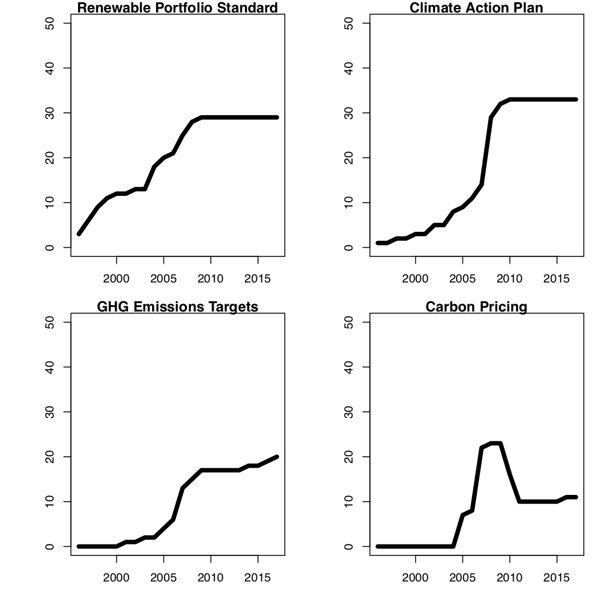

  
```{r setup, include=FALSE}
knitr::opts_chunk$set(warning = FALSE, message = FALSE, 
                      fig.retina = 3, fig.align = "center")
```

```{r xaringanExtra, echo=FALSE}
xaringanExtra::use_webcam()
```

.pull-left[
# Polycentricity

<br>
<figure>
  
</figure>
]

.pull-right[

</br>
</br>
</br>
**POLI 443 - EVSS 595: Governance of Social-Ecological Systems**

**Fall 2021**

.light[Matthew Nowlin, PhD<br>
Department of Political Science<br>
College of Charleston
]

]

---

class: center, middle 

# Problems of scale 

---

class: middle

> _Many problems conceptualized as ‘‘global problems’’ are the cumulative result of actions taken by individuals, families, small groups, private firms, and local, regional, and national governments._ 

-*Ostrom* 2010, pg 550
---

class: title title-1

# Problems of Scale 

**Institutional arrangements that cross biophysical boundaries**

--

* Colorado river crosses five states 

* Amazon rainforest crosses multiple countries 

* Natural parks and protected areas 

* Border fences may disrupt ecosystems 

--

**The governance of shared resources in larger systems can become complicated**

---

class: title title-1

# Polycentric Governance 

--

**Polycentricity**: a social system composed of many decision centers having power to make decisions 

--

* Linked and overlapping action arenas at different levels
* Each decision center has limited and autonomous prerogatives 
* Operate under an overarching set of rules
* _Science_, _markets_, _federalism_

--

Compare to a **Monocentric system** with one center of power, such as a centralized state 

---

class: title title-1

# Polycentric Governance 

**What is the proper level of authority? Which government functions at which level?** 

--

**Metropolitan areas**  

* Concern that multiple government units operating in the same area was leading to chaos 

---

class: title title-1

# Polycentric Governance 


**Water industry performance in California** 
* _Substantial evidence was found that multiple public and private agencies had searched out productive ways of organizing water resources at multiple scales and simply the presence of multiple government units without a clear hierarchy was not chaotic_ 

---

class: title title-1

# Polycentric Governance 


.pull-left[
**Policing** 
* Crime lab: centralized 
* Stations: neighborhood based 
]

--

.pull-right[
**Education** 
* Local tax dollars 
* _Move to area with better schools_ 
]

--

**Other issues? Other countries?** 

???
what issues like guns, abortion? 

federal government: standards, wealth redistribution, protection of rights 
---

class: title title-1

# Polycentric Governance 

**Advantages** 

--
* Innovation 

--
* Learning

--
* Adaptation 

--
* Trustworthiness 

--
* Cooperation 

--
* More effective, equitable, and sustainable outcomes at multiple scales

--
* "Matching principal": problems that impact multiple levels should have contributions from those levels  

---

class: center, middle 

# How can we address climate change? Why aren't we? 

???
what is the convention theory of collective action (e.g., prisoners dilemma, freeriding, tragedy of the commons)

are we doing nothing on climate change?

is the global scale the only scale that matters?
---

class: center, middle 

# What would a polycentric approach to climate change look like? 

---

class: title title-1

# Polycentricity and Climate 

**Local-level efforts and alliances to reduce local-level externalities** 
* Retrofitting homes and buildings 

* GHG inventories in cities

* "Green" efforts by cities and utilities 

* U.S. Conference of Mayors’ Climate Protection Agreement

* _What is Charleston doing?_  

---

class: title title-1

# Polycentricity and Climate 

**State-level projects in the United States** 

.pull-left[
* California, Colorado, Florida 

* Regional Greenhouse Gas Initiative (RGGI)
]

.pull-right[
<figure>
<center>
  
</figure>
]

---

class: title title-1

# Polycentricity and Climate 

**European efforts** 

* England: national, regional, and local planning efforts 
  * Westmill Co-Op wind farm: _the first 100% community owned onshore wind farm to be built in the south of England_ 
  
--

* European Union Emissions Trading Scheme (EU-ETS)
  * _saved more than 1 billion tons (3.8%) of CO2 between 2008 and 2016_ 

---

class: center, middle 

# What issues exist with a polycentric approach? 

---

class: title title-1

# Polycentricity and Climate 

* Leakage 
  * Location: emission generation moved from location _X_ to _Y_ 
  * Market: price changes / increase 
  
--

* Inconsistent policies

--
* Inadequate certification and reporting 

--
* Gaming the system

--
* Free riding

--
* **Blocking or veto points** 

--
* **Need more comparison (time and location) studies**

---

<figure>
<center>
  
</figure>


