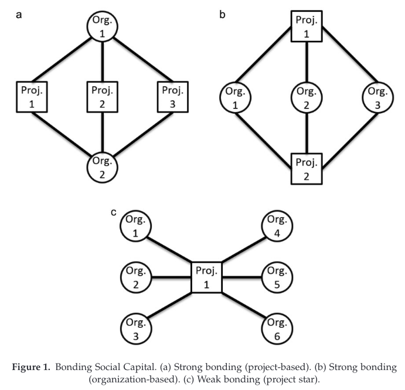

  
```{r setup, include=FALSE}
knitr::opts_chunk$set(warning = FALSE, message = FALSE, 
                      fig.retina = 3, fig.align = "center")
```

```{r xaringanExtra, echo=FALSE}
xaringanExtra::use_webcam()
```

.pull-left[
# Ecology of Games

<br>
<figure>
  
</figure>
]

.pull-right[

</br>
</br>
</br>
**POLI 443 - EVSS 595: Governance of Social-Ecological Systems**

**Fall 2021**

.light[Matthew Nowlin, PhD<br>
Department of Political Science<br>
College of Charleston
]

]

---

class: center, middle 

# Polycentricity and the Ecology of Games 

---

class: title title-1

# Polycentric Governance 

**Polycentricity**: a social system composed of many decision centers having power to make decisions 

--

_the term polycentricity continues to encompass the three core attributes identified by Ostrom et al. (1961, p. 831)_: 
* many autonomous units formally independent of one another,
* choosing to act in ways that take account of others, 
* through processes of cooperation, competition, conflict, and conflict resolution

.tiny[Berardo, Ramiro, and Mark Lubell. 2019. “The Ecology of Games as a Theory of Polycentricity: Recent Advances and Future Challenges.” _Policy Studies Journal_ 47(1): 6–26.
]

---

class: title title-1

# Polycentricity and Climate 

**Multiple actions across actors and scales** 

* Global 

* National 

* Sub-national 

* Actors: private, public, non-profit 

* Policy and innovation 

???
advantages and disadvantages; trade-offs (regulatory certainty; innovation and uncertainty)

---

<figure>
<center>
  
</figure>

???
climate policy regime: loose 

---

class: center, middle 

# What is the Ecology of Games? 

---

class: title title-1

# Ecology of Games 

* Governance involves multiple policy games operating simultaneously within a geographically defined policy arena 

--

* A policy game consists of a set of policy actors participating in a rule-governed collective decision making process called a “policy institution”

--

* The policy institutions that exist at a particular time and place combine to define the institutional arrangements of governance

.tiny[Lubell, Mark. 2013. “Governing Institutional Complexity: The Ecology of Games Framework.” Policy Studies Journal 41(3): 537–59.
]

---

class: title title-1

# Ecology of Games 

<figure>
<center>
  
</figure>

???
how does this compare to action arenas? 
---

class: title title-1

# Ecology of Games 

**The EGT aims to remedy two major problems with the concept of polycentricity** 

--

* Remove normative prescription that polycentric approaches are preferred  
  * No real monocentric comparisons 

--

* How do complex adaptive systems (polycentric) evolve over time 

---

class: title title-1

# Ecology of Games 

.small[_The main insight of the EGT as a theory of polycentricity is that complex governance systems are characterized by the existence of multiple "policy games" operating simultaneously within a geographically defined policy arena. Each of these games can be thought of as a rule-governed collective decision-making process, dealing with one or more policy problems (e.g., water quality, transportation, education, public health, etc.), usually taking place inside well-defined forums or venues (e.g., a planning process, a city council, a legislative committee, etc.) with multiple "players," or policy actors who are endowed with a unique combination of resources and policy preferences_]

???
updated definition from the 2019 article pg 10 
---

class: title title-1

# Ecology of Games 

**Interconnected components with different types of network relationships** 

--

**Network relationships can be understood by structure and function** 

--

* _Structure_: the architecture of the system 

--

* _Function_: the dynamic processes that operate within the system and affect its change and performance

---

class: title title-1

# Ecology of Games 

**Network structure characteristics** 

--

* The informal and formal rules governing collective decision making within different individual forums

--

* The patterns of interactions among policy actors
  * Formal or informal 

--

* The level of interconnections among policy-relevant issues
  * _rooted in the biophysical interconnections inherent in ecological systems_ 
---

class: title title-1

# Ecology of Games 

**Network functions** 

--

* **Cooperation**: involves shaping the behavior of multiple actors in ways that increase the likelihood that they will jointly contribute to achieving outcomes that are both collectively and individually desirable

---

class: title title-1

# Ecology of Games 

**Network functions** 

* **Learning**: takes place when actors can effectively process new information about problems they care about, and about how other actors think about those problems

--

* **Resource distribution**: refers to the way in which collective benefits and costs are distributed across the myriad stakeholders that partake in the governance system

---

class: title title-1

# Ecology of Games 

**Network capital: social capital in networks** 

--

**Bonding**: _actors in a group create relationships that bring them closer together, thus improving the quality of information available to each of them about what others in the group are likely to do in specific situations_  
* Cooperation 
* "Closed triangle" 

---

class: title title-1

# Ecology of Games 

**Network capital: Bonding** 

<figure>
<center>
  
</figure>

---

class: title title-1

# Ecology of Games 

**Network capital: social capital in networks** 


**Bridging**: _actors in a group create ties that extend beyond their close set of acquaintances and connect them to other groups with whom they had little or no contact up to that point_  

* Coordination 

---

class: title title-1

# Ecology of Games 

**Network capital: Bridging** 

<figure>
<center>
  
</figure>

---

class: center, middle 

# How can the Ecology of Games apply to your case study or research topic? 


